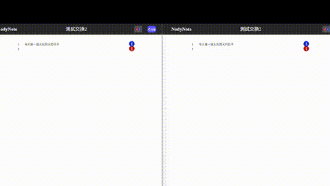
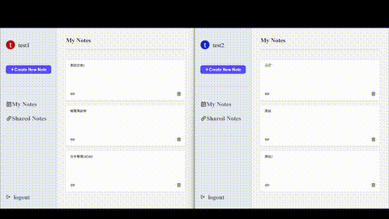

# Nodynote

[https://nodynote.com/](https://nodynote.com/)

*Nodynote*為一套以 FastAPI 開發的後端系統，主要處理多人共用筆記情境下的使用者驗證、權限控管、資料一致性與狀態持久化問題。系統重點不在單純功能實作，而是針對多人同時操作同一份資料時，如何在後端維持資料正確性與系統穩定性。

## 使用DEMO

小提醒：若要在同一台電腦開兩個帳號測試，以GOOGLE CHROME為例，兩個帳號務不能使用同一個瀏覽器開啟，請務必使用CHROME的不同帳號，或是一個一般模式、一個無痕模式，或是使用兩個不同的瀏覽器，避免怎麼登入，都會登到同一個帳號的情況發生。

**_另外，結束使用請務必按下登出按鈕，不要直接關掉，謝謝。_**

**_如果測試帳號被占用，也可以註冊新的帳號做測試，謝謝。_**

可以先選擇測試帳號 (總共有五個測試帳號，有下拉式選單可以選擇並直接代入)

測試帳號1

帳號：test1@test.com

密碼：123

測試帳號2

帳號：test2@test.com

密碼：456

---

共同編輯demo

---

權限設置demo

## 專案說明

### 此專案為一套多人協作筆記系統的後端，支援：

- 使用者註冊與登入
- 筆記建立與管理
- 筆記共享與權限設定
- 多人同時編輯同一份筆記

### 後端設計重點

- 使用者驗證與授權（Authentication / Authorization）
- 多人操作下的資料一致性控制
- 高頻更新場景下的狀態管理與資料持久化
- API 與 WebSocket 的責任分工設計

## 後端設計核心

### 1. 使用者驗證與權限控管

- 使用 JWT 作為登入驗證機制
- 實作角色權限系統（Role-Based Access Control）
  - owner（擁有者）
  - editor（可編輯）
  - viewer（唯讀）
- 所有筆記操作皆透過後端進行權限檢查
- WebSocket 連線建立前亦會驗證使用者權限

👉 確保不同角色只能執行對應操作，避免未授權存取

### 2. 多人編輯下的資料一致性處理

- 設計版本控制機制（version-based validation）
- 每一行筆記內容皆維護獨立 version
- Client 更新資料時需帶 version，由後端進行驗證

#### 處理流程：

- 若 client version 與 server version 相同 → 接受更新
- 若不一致 → 新資料寫入失敗，自動回復成舊資料

👉 避免 stale write（舊資料覆蓋新資料）問題

👉 在多人同時編輯情境下維持資料一致性

### 3. 狀態管理與資料持久化策略

- 採用「定期批次寫入」方式降低 DB 壓力(每30秒)
- 當最後一位使用者離開時，執行最終資料寫入

👉 降低高頻更新對資料庫的負擔

👉 在效能與資料安全之間取得平衡

### 4. API 與 WebSocket 架構分工

- RESTful API：
  - 使用者管理
  - 筆記 CRUD
  - 權限設定
- WebSocket：
  - 處理多人編輯過程中的即時資料傳遞

👉 根據操作性質拆分通訊方式

👉 提升系統可維護性與擴展性

## 技術使用

- **FastAPI**：後端網頁框架，快速建立RESTful API

- **Websocket**：支援共同編輯即時同步

- **Docker**：容器化部署，方便跨環境運行

- **Nginx**：反向代理、HTTPS和靜態檔案運行

- **Certbot**：自動SSL續期、確保安全連線

## 系統功能

- 使用者註冊 / 登入
- 筆記建立與管理
- 筆記共享與權限控管
- 多人同時編輯（含衝突檢測）
- 編輯狀態管理
- 定期資料持久化

## 系統架構與流程

- 架構圖

- Websocket流程

- MySQL ERD

## 後端技術重點

- 實作角色權限系統以控管筆記存取
- 設計 server-side 衝突檢測機制處理多人更新
- 建立記憶體狀態 + 定期持久化策略降低資料庫負擔
- 拆分 REST API 與 WebSocket 職責以應對不同操作場景
