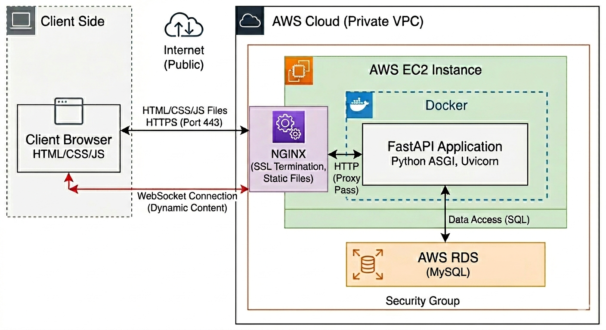
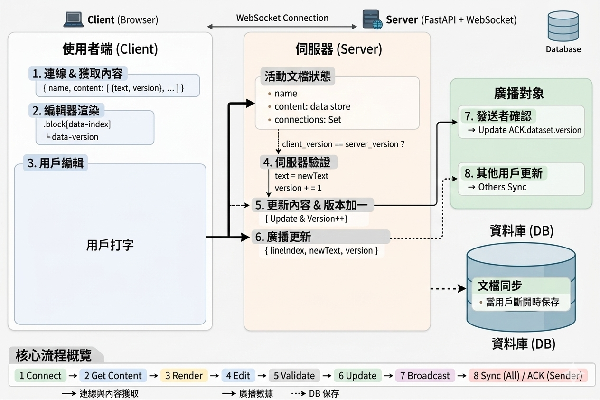

# [Nodynote](https://nodynote.com/)

*Nodynote*是一個簡易的共享筆記系統，支援多人即時共編，專案是用來展示後端API設計、前端互動以及系統架構能力

## 專案目標與角色

-**專案目標**：設計一個多人協作的筆記系統，並展示完整的前後端架構與即時同步能力

-**我的角色**：

- 設計並實作後端RESTFUL API

- 前端筆記列表與即時更新

- 系統部署與Docker包裝

- 確保HTTPS與憑證自動續期流程

---

## 技術棧與選題理由

- **FastAPI**：後端網頁框架，快速建立RESTful API

- **Websocket**：支援共同編輯即時同步

- **Docker**：容器化部署，方便跨環境運行

- **Nginx**：反向代理、HTTPS和靜態檔案運行

- **Certbot**：自動SSL續期、確保安全連線

---

## 系統架構與流程

- 架構圖

- Websocket流程

- MySQL ERD

---

## 核心技術亮點

- **多人協作**：WebSocket 確保任務更新即時同步

- **衝突處理**：後端對同一任務操作使用版本控制避免覆蓋

- **自動部署**：Docker Compose + Nginx + SSL 自動續期

- **前後端分離**：RESTful API 與前端分離，利於擴充

---

## 專案成果

- 前端筆記列表可以進行基本CRUD，編輯筆記可以共同即時編輯

- 後端API可以完整實作CRUD和驗證

- HTTPS自動續期驗證成功

---

## 未來優化方向

- 優化共編系統，讓使用者可以更流暢地操作
